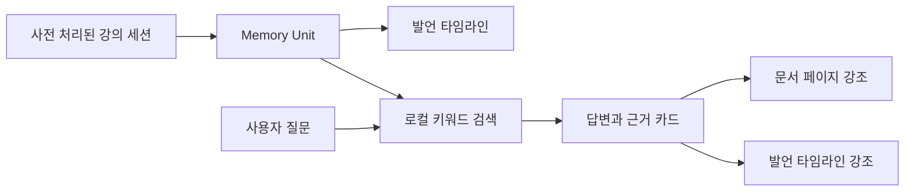

<div align="center">

# AnythingNote

### 말과 화면을 함께 기억하는 멀티모달 AI 노트

발언의 타임스탬프와 당시 보고 있던 문서 장면을 하나의 `Memory Unit`으로 연결하고,<br>
질문에 대한 답과 근거 장면을 함께 찾아주는 온디바이스 노트 경험을 제안합니다.

[](https://react.dev/)
[](https://www.typescriptlang.org/)
[](https://vite.dev/)
[](https://vitest.dev/)


[소개](#소개) · [핵심 기능](#핵심-기능) · [빠른 시작](#빠른-시작) · [동작 방식](#동작-방식) · [MVP 범위](#mvp-범위)

**2026 경희대학교 Nexus Innovation Challenge · 08팀 AOM**

</div>

## 소개

강의나 회의가 끝난 뒤 중요한 말을 들었다는 사실은 기억나지만, 그때 어떤 자료를 보고 있었는지는 쉽게 잊힙니다. AnythingNote는 이 문제를 해결하기 위해 다음 정보를 하나의 기억 단위로 묶습니다.

- **무엇을 들었는지** — 발언 원문과 요약
- **언제 들었는지** — 발언 타임스탬프
- **무엇을 보고 있었는지** — 해당 시점의 문서 페이지
- **왜 중요한지** — 시험, 과제, 핵심 개념 등의 중요도

사용자가 자연어로 질문하면 관련 `Memory Unit`을 검색하고, 답변과 함께 시각·문서 페이지·발언 원문을 근거로 보여줍니다. 근거 카드를 선택하면 문서 장면과 발언 타임라인이 동시에 강조됩니다.

> 현재 저장소는 이 핵심 경험을 검증하기 위한 **사전 처리 데이터 기반의 로컬 웹 MVP**입니다. 실시간 녹음·화면 캡처·AI 모델 추론은 아직 포함하지 않습니다.

## 핵심 기능

### 문서와 발언을 하나의 기억으로

발언과 당시의 PDF 페이지 이미지를 연결하여, 텍스트 기록만으로는 놓치기 쉬운 시각적 맥락을 보존합니다.

### 근거가 보이는 질의응답

답변만 제시하지 않고 관련 시각, 페이지 번호, 발언 원문과 요약을 함께 제공합니다. 찾은 근거가 없을 때는 내용을 추측하지 않습니다.

### 연결된 탐색 경험

타임라인의 발언이나 검색 결과의 근거 카드를 선택하면 해당 문서 페이지로 즉시 이동하고 두 영역을 함께 강조합니다.

### 로컬 우선 데모

설치 이후 외부 API나 인터넷 연결 없이 동작합니다. 같은 질문에는 항상 같은 결과를 돌려주는 결정적 키워드 검색으로 시연 흐름을 안정적으로 재현합니다.

## 빠른 시작

### 요구 사항

- Node.js `20.19.0` 이상 또는 `22.12.0` 이상
- npm

### 설치 및 실행

```bash
git clone https://github.com/nxtcloud-edu/2026-khuniv-NIC-team08.git
cd 2026-khuniv-NIC-team08
npm install
npm run dev
```

터미널에 표시되는 주소를 브라우저에서 엽니다. 기본 주소는 `http://localhost:5173`입니다.

## 사용해 보기

1. 앱을 열어 준비된 운영체제 강의 세션을 확인합니다.
2. 오른쪽 타임라인에서 발언을 선택해 연결된 문서 페이지로 이동합니다.
3. 하단 질문창에 한국어 질문을 입력하고 **검색**을 누릅니다.
4. 답변 아래에 표시된 근거 카드를 선택합니다.
5. 연결된 PDF 페이지와 타임라인 발언이 함께 강조되는지 확인합니다.

시연 데이터에서 사용할 수 있는 질문은 다음과 같습니다.

| 질문 | 연결되는 근거 |
| --- | --- |
| `시험에 나온다고 한 부분이 뭐야?` | `18:32 · PDF 12페이지` 시험 발언 |
| `과제는 언제까지야?` | `23:10 · PDF 15페이지` 과제 안내 |
| `핵심 개념이 뭐야?` | `12:05 · PDF 10페이지` 핵심 개념 설명 |
| `오늘 점심 메뉴가 뭐야?` | 관련 근거 없음 |

30초 발표 시연 순서는 [DEMO.md](DEMO.md)에서 확인할 수 있습니다.

## 동작 방식



검색 과정은 모두 브라우저 안에서 진행됩니다.

1. 질문에서 공백과 문장부호를 제거해 검색용 문자열로 정규화합니다.
2. 시험·과제·핵심 개념에 대한 동의어와 각 `Memory Unit`의 키워드를 비교합니다.
3. 키워드, 발언 원문, 요약의 일치 정도와 중요도 의도를 점수화합니다.
4. 가장 관련성 높은 하나의 근거를 반환하고, 일치하는 어휘가 없으면 근거 없음으로 처리합니다.

### Memory Unit

```ts
interface MemoryUnit {
  id: string;
  timestamp: string;
  pageNumber: number;
  transcript: string;
  summary: string;
  importance: "exam" | "assignment" | "key" | "normal";
  keywords: string[];
}
```

## 기술 구성

| 영역 | 기술 | 역할 |
| --- | --- | --- |
| UI | React 19 | 문서 뷰어, 타임라인, 질의응답 화면 |
| 언어 | TypeScript 6 | 데이터 계약과 컴포넌트 타입 검사 |
| 개발 환경 | Vite 8 | 개발 서버와 프로덕션 빌드 |
| 테스트 | Vitest, Testing Library | 검색 로직, 컴포넌트, 통합 흐름 검증 |
| 품질 검사 | ESLint | 정적 코드 검사 |

## 프로젝트 구조

```text
public/demo/pages/          시연용 강의 페이지 이미지
src/
├─ components/
│  ├─ search/               질문 패널과 근거 카드
│  └─ workspace/            문서 뷰어, 타임라인, 세션 상태
├─ data/demoSession.ts      사전 처리된 데모 세션
├─ lib/search.ts            로컬 검색과 답변 생성
├─ styles/                  디자인 토큰과 전역 스타일
├─ types/session.ts         세션과 Memory Unit 타입
└─ App.tsx                  화면 상태와 상호작용 통합
```

## 개발 명령어

| 명령어 | 설명 |
| --- | --- |
| `npm run dev` | 개발 서버 실행 |
| `npm run build` | TypeScript 검사 후 프로덕션 빌드 |
| `npm run preview` | 프로덕션 빌드 결과 미리보기 |
| `npm run test` | 전체 테스트 실행 |
| `npm run test:watch` | 테스트 감시 모드 실행 |
| `npm run lint` | ESLint 검사 |

변경 사항은 다음 명령으로 한 번에 검증할 수 있습니다.

```bash
npm run lint
npm run test
npm run build
```

## MVP 범위

| 현재 구현 | 향후 확장 |
| --- | --- |
| 사전 처리된 단일 강의 세션 | 실시간 마이크·시스템 오디오 녹음 |
| PDF 페이지 이미지 탐색 | 실시간 화면 캡처, 변화 감지, OCR |
| 발언 타임라인과 중요도 배지 | Whisper 기반 음성 인식 |
| 발언과 페이지를 잇는 Memory Unit | BM25·임베딩 기반 하이브리드 검색 |
| 한국어 키워드 질의응답 | 온디바이스 SLM 답변 생성 |
| 근거 선택 시 문서·발언 동시 강조 | 세션 저장소와 데스크톱 앱 배포 |

화면의 `On-device concept demo`와 `Local demo data` 표시는 현재 기능이 실제 온디바이스 AI 파이프라인이 아니라, 제품 경험을 검증하기 위한 로컬 콘셉트 데모임을 뜻합니다.

## 관련 문서

- [DEMO.md](DEMO.md) — 30초 발표 시연 순서와 촬영 체크리스트
- [PLAN.md](PLAN.md) — MVP 목표, 범위, 데이터 모델과 완료 기준
- [ROLE.md](ROLE.md) — 구현 역할과 컴포넌트 계약

---

<div align="center">

**AnythingNote** — 들은 말과 본 장면을 하나의 기억으로.

</div>
