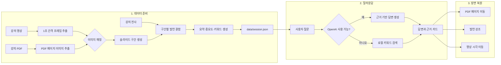

<div align="center">

# 📝 AnythingNote

### 말과 화면을 함께 기억하는 멀티모달 AI 노트

**들은 내용과 당시 보고 있던 문서를 연결하고, 질문의 근거 장면까지 찾아주는 학습 노트 서비스**

[](https://react.dev/)
[](https://www.typescriptlang.org/)
[](https://vite.dev/)
[](https://vitest.dev/)

[🎯 프로젝트 소개](#-프로젝트-소개) · [✨ 핵심 기능](#-핵심-기능) · [⚙️ 설치 및 실행](#️-설치-및-실행) · [🧪 테스트 실행 방법](#-테스트-실행-방법) · [🔄 파이프라인](#-파이프라인)

**2026 경희대학교 Nexus Innovation Challenge · 08팀 AOM**

</div>

---

## 🎯 프로젝트 소개

강의를 들으며 기록한 음성과 문서가 서로 분리되어 있으면, 나중에 전사를 읽더라도 특정 발언이 어떤 슬라이드를 가리키는지 찾기 어렵습니다. AnythingNote는 강의 발언, 타임스탬프, 당시의 PDF 페이지, 중요도를 하나의 **Memory Unit**으로 연결해 이 문제를 해결합니다.

사용자는 자연어로 강의 내용을 검색하고 답변의 근거가 된 발언을 확인할 수 있습니다. 근거를 선택하면 문서 페이지, 발언 타임라인, 강의 영상이 같은 시점으로 이동하므로 질문에서 실제 강의 장면까지 곧바로 되짚을 수 있습니다.

| Memory Unit 정보 | 설명 | 예시 |
| --- | --- | --- |
| 발언 | 강의 전사 원문과 요약 | “이 부분은 시험에 나옵니다.” |
| 시각 | 발언이 시작된 영상 위치 | `00:18:32` |
| 문서 | 당시 화면에 표시된 PDF 페이지 | 12페이지 |
| 중요도 | 시험·과제·핵심·일반 분류 | `exam` |

## ✨ 핵심 기능

### 🔗 발언과 문서 연결

강의 전사의 타임스탬프와 해당 시점의 PDF 페이지를 연결합니다. 텍스트만으로는 알기 어려운 시각적 맥락을 발언과 함께 보존합니다.

### 💬 근거 기반 질의응답

질문에 대한 답변과 함께 발언 시각, PDF 페이지, 발언 원문, 요약을 근거 카드로 제공합니다. 세션 안에서 관련 근거를 찾지 못하면 내용을 추측하지 않고 근거가 없음을 안내합니다.

### 🎬 강의 장면 동기화

타임라인의 발언이나 답변의 근거 카드를 선택하면 문서 뷰어와 타임라인이 함께 이동합니다. 영상이 포함된 세션에서는 재생 위치도 해당 발언 시각으로 맞춰집니다.

### 🔌 OpenAI 및 로컬 검색 지원

OpenAI API 키를 연결하면 근거를 바탕으로 자연어 답변을 생성합니다. 키가 없거나 API 호출에 실패하면 결정적인 로컬 키워드 검색으로 자동 전환되므로 기본 검색 기능은 네트워크 없이도 사용할 수 있습니다.

## ⚙️ 설치 및 실행

### 📋 요구 사항

- Node.js `^20.19.0` 또는 `>=22.12.0`
- npm

데이터를 다시 생성할 때만 FFmpeg가 추가로 필요합니다.

### 📦 설치

```bash
git clone https://github.com/nxtcloud-edu/2026-khuniv-NIC-team08.git
cd 2026-khuniv-NIC-team08
npm install
```

### 🔑 OpenAI 연결

API 키 없이도 로컬 검색으로 서비스를 사용할 수 있습니다. OpenAI 답변을 사용하려면 화면 상단의 **OpenAI 연결** 패널에 API 키를 입력하거나 로컬 개발용 `.env` 파일을 설정합니다.

```bash
cp .env.example .env
```

`.env`에서 다음 값을 설정할 수 있습니다.

| 환경 변수 | 설명 |
| --- | --- |
| `VITE_OPENAI_API_KEY` | OpenAI API 키 |
| `VITE_OPENAI_MODEL` | 답변 생성에 사용할 모델 |
| `VITE_OPENAI_BASE_URL` | OpenAI 호환 API 기본 URL |

### 🧰 명령어 모음

| 명령어 | 용도 | 접속 주소 |
| --- | --- | --- |
| `npm run dev` | 기본 mock 세션으로 개발 서버 실행 | `http://localhost:5173/` |
| `npm run dev:example` | 자료 입력부터 실제 강의 데모까지 전체 흐름 실행 | `http://localhost:5173/?demo=example&flow=full` |
| `npm run dev:demo` | `dev:example`과 같은 전체 시연 흐름 실행 | `http://localhost:5173/?demo=example&flow=full` |
| `npm run build` | 타입 검사 후 프로덕션 빌드 생성 | - |
| `npm run preview` | 생성된 프로덕션 빌드 미리보기 | 터미널에 표시된 주소 |

`flow=full`을 사용하면 자료와 프롬프트 입력 화면부터 시작합니다. 자료를 하나 이상 첨부해 노트 만들기를 누르면 처리 화면을 거치고, 완료 후 주소가 `?demo=example`로 바뀌며 작업 공간이 열립니다. 처리 화면은 **바로 열기** 버튼이나 `Space`, `Enter`, `Esc` 키로 넘길 수 있습니다.

| 쿼리 매개변수 | 값 예시 | 설명 |
| --- | --- | --- |
| `processing` | `7000` | 처리 화면 표시 시간을 밀리초 단위로 지정합니다. `0`이면 건너뜁니다. |
| `phase` | `upload`, `processing`, `workspace` | 지정한 화면부터 서비스를 시작합니다. |

실제 강의 데이터의 구성과 재생성 방법은 [data/EXAMPLE.md](data/EXAMPLE.md)에서 확인할 수 있습니다.

## 🧪 테스트 실행 방법

### ✅ 자동 테스트

| 명령어 | 검증 범위 |
| --- | --- |
| `npm run example:check` | PDF, 전사, Memory Unit, 페이지 이미지, 영상의 데이터 무결성 |
| `npm run test` | 컴포넌트와 검색·동기화 로직의 단위 및 통합 테스트 |
| `npm run lint` | 소스 코드 정적 검사 |
| `npm run build` | TypeScript 타입 검사와 프로덕션 빌드 |
| `npm run smoke` | 데이터 무결성 검사, 전체 테스트, 프로덕션 빌드를 순서대로 실행 |

전체 동작을 한 번에 확인하려면 다음 명령을 사용합니다.

```bash
npm run smoke
```

테스트 환경에서는 OpenAI 설정을 비워 두므로 실제 API를 호출하지 않고 로컬 검색 경로를 검증합니다.

### 🎓 실제 강의 데이터로 시연

```bash
npm run dev:example
```

브라우저가 자동으로 열리지 않으면 `http://localhost:5173/?demo=example&flow=full`에 접속합니다.

#### 🎬 시연 순서

1. 시작 화면에서 강의 자료를 하나 이상 첨부하고 프롬프트를 입력한 뒤 노트 만들기를 선택합니다.
2. 노트 생성 아이콘과 진행 바가 끝난 뒤 주소가 `?demo=example`로 바뀌는지 확인합니다.
3. 상단에서 세션 제목 `ML Basics · Model, Loss Function, Optimizer`, 강의 길이, Memory Unit 개수를 확인합니다.
4. 발언 타임라인에서 항목을 선택하고 연결된 PDF 페이지와 영상 시각으로 이동하는지 확인합니다.
5. 질문창에 예시 질문을 입력하고 **검색**을 선택합니다.
6. 답변 아래의 근거 카드를 선택하고 PDF 페이지, 타임라인 강조, 영상 재생 위치가 같은 장면으로 이동하는지 확인합니다.

#### 💬 질문 예시

| 질문 | 확인할 근거 |
| --- | --- |
| `학습 방식 세 가지가 뭐야?` | 00:40 · 3페이지 · 지도학습, 비지도학습, 강화학습 |
| `확률을 계속 곱하면 작아지는 문제는 어떻게 해결해?` | 08:55 · 20페이지 · 로그 우도 |
| `정규화가 뭐야?` | 22:23 · 30페이지 · 편향·분산과 정규화 |
| `마지막 퀴즈는 언제야?` | 50:35 · 59페이지 · 강의 마지막 퀴즈 |

업로드부터 작업 공간까지의 전체 흐름을 검증하려면 `npm run dev:demo`를 사용하고 같은 순서로 확인합니다.

## 🔄 파이프라인



### 1️⃣ 데이터 준비

1. PDF에서 68개 페이지 이미지를 추출합니다.
2. 공개용 강의 영상을 1초 간격으로 분석하고 PDF 페이지와 정규화 상관도로 비교합니다.
3. 연속된 매칭 결과를 슬라이드 구간으로 묶고 각 구간의 대표 프레임을 생성합니다.
4. 전사의 절대 시각을 영상의 상대 시각으로 변환해 해당 슬라이드 구간에 배정합니다.
5. 구간별 주제, 요약, 중요도, 키워드를 생성해 Memory Unit으로 저장합니다.
6. `npm run example:check`가 생성 결과를 원본 PDF 및 전사와 대조합니다.

세션을 다시 생성하려면 다음 명령을 사용합니다.

```bash
npm run session:build
npm run session:build -- --skip-llm
```

`--skip-llm` 옵션은 외부 API 없이 규칙 기반 요약을 사용합니다. 공개용 영상을 다시 만들려면 `npm run example:prepare`를 실행합니다.

### 2️⃣ 질의응답과 장면 복원

OpenAI 경로는 세션의 Memory Unit만 컨텍스트로 사용하고 응답의 `memoryId`가 실제 데이터에 있는지 검증합니다. 로컬 경로는 질문과 발언·요약·키워드·중요도를 비교해 가장 관련성 높은 Memory Unit을 선택합니다. 선택된 Memory Unit의 `pageNumber`, `id`, `timestamp`는 각각 문서 페이지, 타임라인 항목, 영상 재생 위치를 동기화합니다.

### 🧩 Memory Unit 데이터 구조

```ts
interface MemoryUnit {
  id: string;
  timestamp: string;
  pageNumber: number;
  transcript: string;
  summary: string;
  importance: "exam" | "assignment" | "key" | "normal";
  keywords: string[];
}


```

---

<div align="center">

**AnythingNote — 들은 말과 본 장면을 하나의 기억으로 📝**

</div>
