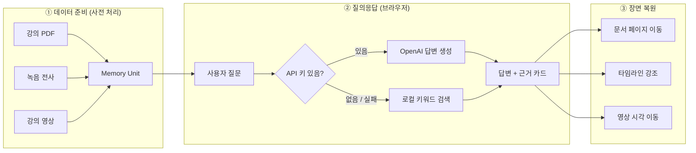

<div align="center">

# 📝 AnythingNote

### 말과 화면을 함께 기억하는 멀티모달 AI 노트

**“그 말을 들을 때 내가 보고 있던 화면”으로 되돌아가는 노트 경험**

[](https://react.dev/)
[](https://www.typescriptlang.org/)
[](https://vite.dev/)
[](https://vitest.dev/)


[🎯 소개](#-프로젝트-소개) · [✨ 핵심 기능](#-핵심-기능) · [⚙️ 설치](#️-설치-및-실행) · [▶️ 데모 실행](#️-데모-실행-방법) · [🔄 파이프라인](#-파이프라인)

**2026 경희대학교 Nexus Innovation Challenge · 08팀 AOM**

</div>

---

## 🎯 프로젝트 소개

> **강의에서 들은 말을 그때 보고 있던 문서 페이지와 함께 기억하고,**
> **질문하면 답변과 “근거 장면”을 같이 돌려주는 노트입니다.**

녹음과 텍스트만 남기는 기존 노트 도구는 *“중요한 말을 들었다”* 는 사실은 남기지만 *“그때 무엇을 보고 있었는지”* 는 잃어버립니다. 나중에 전사를 읽어도 어떤 슬라이드를 가리키며 한 말인지 되짚기 어렵습니다.

AnythingNote는 흩어진 네 정보를 하나의 **`Memory Unit`** 으로 묶어 이 문제를 해결합니다.

| 무엇을 | 필드 | 예시 |
| --- | --- | --- |
| 🗣️ **무엇을 들었는지** | `transcript` / `summary` | “이 부분은 시험에 나옵니다” |
| ⏱️ **언제 들었는지** | `timestamp` | `00:18:32` |
| 📄 **무엇을 보고 있었는지** | `pageNumber` | PDF 12페이지 |
| ⭐ **왜 중요한지** | `importance` | `시험` / `과제` / `핵심` / `일반` |

덕분에 *“시험에 나온다고 한 부분이 뭐야?”* 라고 묻는 것만으로, 답변과 함께 **그 발언·그 슬라이드·그 영상 구간**으로 한 번에 되돌아갈 수 있습니다.

> ⚠️ **현재 범위** — 이 저장소는 핵심 경험을 검증하기 위한 **사전 처리 데이터 기반 로컬 웹 MVP**입니다.
> 실시간 마이크 녹음, 화면 캡처, OCR, 온디바이스 SLM 추론은 아직 포함하지 않습니다.
> 화면의 `On-device concept demo · Local demo data` 배지는 이 사실을 명시하기 위한 표시입니다.

---

## ✨ 핵심 기능

### 🔗 발언과 문서를 하나의 기억으로

발언 타임스탬프와 그 시점의 PDF 페이지 이미지를 `Memory Unit`으로 연결합니다. 텍스트 기록만으로는 사라지는 **시각적 맥락**이 그대로 남습니다.

### 💬 근거가 보이는 질의응답

한국어로 질문하면 답변과 함께 **발언 시각 · PDF 페이지 · 발언 원문 · 요약**을 근거 카드로 제시합니다. 답변은 세션의 `Memory Unit` 안에서만 만들어지며, 관련 근거가 없으면 지어내지 않고 **“관련 근거를 찾지 못했습니다”** 라고 답합니다.

### 🎬 근거를 누르면 그 장면으로

타임라인의 발언이나 근거 카드를 선택하면 **문서 뷰어 · 타임라인 · 강의 영상**이 동시에 그 지점으로 이동하고 함께 강조됩니다. 실제 강의 데모에서는 영상 재생 위치까지 해당 시각으로 맞춰집니다.

### 🔌 GPT 연결은 선택, 기본은 로컬

API 키가 있으면 **OpenAI**가 근거 기반 자연어 답변을 생성하고, 키가 없거나 호출이 실패하면 **결정적 로컬 키워드 검색**으로 자동 전환됩니다. 네트워크 없이도 항상 같은 시연 결과를 재현할 수 있습니다.

---

## ⚙️ 설치 및 실행

### 요구 사항

- **Node.js** `^20.19.0` 또는 `>=22.12.0`
- **npm**

### 설치

```bash
git clone https://github.com/nxtcloud-edu/2026-khuniv-NIC-team08.git
cd 2026-khuniv-NIC-team08
npm install
```

### 실행

```bash
npm run dev
```

터미널에 표시되는 주소(기본값 `http://localhost:5173`)를 브라우저에서 엽니다.

### 🔑 (선택) OpenAI 연결

키를 넣지 않아도 앱은 로컬 검색으로 완전히 동작합니다. GPT 답변 생성을 쓰려면 둘 중 하나를 선택하세요.

| 방법 | 사용 시점 |
| --- | --- |
| 화면 상단 **`OpenAI 연결`** 패널에 키 입력 | 권장. 키는 브라우저에만 저장됩니다 |
| `.env` 파일에 `VITE_OPENAI_API_KEY` 설정 | 로컬 개발 편의용 |

```bash
cp .env.example .env   # VITE_OPENAI_API_KEY / VITE_OPENAI_MODEL / VITE_OPENAI_BASE_URL
```

> ⚠️ Vite는 `VITE_` 접두사 값을 브라우저 번들에 그대로 포함합니다. **배포 빌드에는 키를 넣지 마세요.**

---

## ▶️ 데모 실행 방법

두 종류의 세션이 준비되어 있습니다.

| 데모 | 주소 | 내용 |
| --- | --- | --- |
| 🧪 **기본 mock** | `http://localhost:5173` | 가상의 운영체제 5주차 강의 · 3페이지 · Memory Unit 4개 |
| 🎓 **실제 강의** | `http://localhost:5173/?demo=example` | 실제 ML 강의 52분 · PDF 68페이지 · 전사 495구간 · 대표 4페이지 · **영상 연동** |

### 시연 순서

1. 앱을 열어 세션 헤더(세션 길이, Memory Unit 개수)를 확인합니다.
2. 오른쪽 **발언 타임라인**에서 발언을 선택 → 연결된 문서 페이지로 이동합니다.
3. 하단 질문창에 한국어 질문을 입력하고 **검색**을 누릅니다.
4. 답변 아래 **근거 카드**를 선택합니다.
5. PDF 페이지 · 타임라인 발언 · (실제 강의 데모라면) 영상 위치가 함께 이동·강조되는지 확인합니다.

### 예시 질문

<table>
<tr><th>🧪 기본 mock 데모</th><th>연결되는 근거</th></tr>
<tr><td><code>시험에 나온다고 한 부분이 뭐야?</code></td><td>18:32 · PDF 12페이지 · 컨텍스트 스위치 구조도</td></tr>
<tr><td><code>과제는 언제까지야?</code></td><td>23:10 · PDF 15페이지 · 스케줄링 시뮬레이터 과제</td></tr>
<tr><td><code>핵심 개념이 뭐야?</code></td><td>12:05 · PDF 10페이지 · 준비/대기 상태 구분</td></tr>
<tr><td><code>오늘 점심 메뉴가 뭐야?</code></td><td><em>관련 근거 없음</em> — 추측하지 않음</td></tr>
</table>

<table>
<tr><th>🎓 실제 강의 데모</th><th>연결되는 근거</th></tr>
<tr><td><code>학습 방식 세 가지가 뭐야?</code></td><td>00:40 · 3페이지 · 지도/비지도/강화학습</td></tr>
<tr><td><code>확률을 계속 곱하면 작아지는 문제는 어떻게 해결해?</code></td><td>08:55 · 20페이지 · 로그 우도</td></tr>
<tr><td><code>정규화가 뭐야?</code></td><td>22:23 · 30페이지 · 편향·분산과 정규화</td></tr>
<tr><td><code>마지막 퀴즈는 언제야?</code></td><td>50:35 · 59페이지 · 강의 마지막 퀴즈</td></tr>
</table>

### ✅ 데모 전 일괄 점검

```bash
npm run smoke
```

fixture 무결성(PDF 68페이지 · 전사 495구간 · 페이지 이미지 · 영상) → 전체 테스트 → 타입 검사와 프로덕션 빌드를 순서대로 확인합니다.

실제 강의 fixture의 구성과 재생성 방법은 [example/EXAMPLE.md](example/EXAMPLE.md)를 참고하세요. 재생성할 때만 원본 영상과 `ffmpeg`가 필요합니다.

---

## 🔄 파이프라인



### ① 데이터 준비 — 원본에서 `Memory Unit`으로

`npm run example:prepare`가 원본 자료를 시연 가능한 fixture로 변환합니다.

1. 📄 이미지 기반 PDF에서 페이지를 추출하고 개수를 검증합니다.
2. 🗣️ 전사의 벽시계 시간을 **영상 시작 시각 기준 상대 시간**으로 환산합니다.
3. 🎬 영상의 참가자 영역을 잘라내고 해상도·프레임률을 낮춘 **공개용 MP4**를 만듭니다.
4. 🔗 `example/session.json` manifest가 *발언 ↔ 페이지 ↔ 중요도*를 묶어 `Memory Unit`을 정의합니다.

### ② 질의응답 — 두 경로, 같은 계약

**🔌 OpenAI 경로** (키가 있을 때)

1. 세션의 모든 `Memory Unit`을 컨텍스트로 전달합니다.
2. *“목록 밖의 지식으로 보충하지 말 것”* 을 시스템 프롬프트로 강제합니다.
3. 모델은 `{ "answer": ..., "memoryId": ... }` JSON 하나만 반환합니다.
4. **반환된 `memoryId`를 실제 `Memory Unit`과 대조**해, 지어낸 id는 버립니다.

**🖥️ 로컬 경로** (키가 없거나 호출 실패 시)

1. 질문에서 공백·문장부호를 제거해 비교용 문자열로 정규화합니다.
2. 시험/과제/핵심 **동의어 사전**과 각 `Memory Unit`의 키워드를 대조해 등장 어휘를 추출합니다.
3. `키워드(×3) + 발언 원문(×2) + 요약(×1) + 중요도 의도 일치(+4)`로 점수를 매깁니다.
4. 최고 점수 **하나만** 반환하고, 점수가 0이면 근거 없음으로 처리합니다. → 같은 질문은 항상 같은 결과.

### ③ 장면 복원 — 근거 하나로 세 화면 동기화

선택된 `Memory Unit`의 `pageNumber`는 문서 뷰어를, `id`는 타임라인 강조를, `timestamp`는 영상 재생 위치를 결정합니다. 세 영역이 **하나의 근거를 공유**하기 때문에 항상 같은 장면을 가리킵니다.

### 데이터 계약

```ts
interface MemoryUnit {
  id: string;
  timestamp: string;                // "HH:MM:SS"
  pageNumber: number;               // 그때 보고 있던 PDF 페이지
  transcript: string;               // 발언 원문
  summary: string;                  // 한 줄 요약
  importance: "exam" | "assignment" | "key" | "normal";
  keywords: string[];               // 로컬 검색용 어휘
}
```

---

<div align="center">

**AnythingNote** — 들은 말과 본 장면을 하나의 기억으로. 📝

</div>
