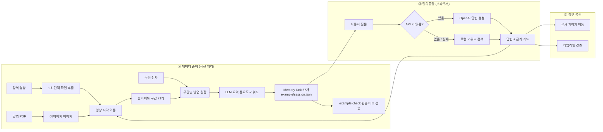

<div align="center">

# 📝 AnythingNote

### 말과 화면을 함께 기억하는 멀티모달 AI 노트

**“그 말을 들을 때 내가 보고 있던 화면”으로 되돌아가는 노트 경험**

[](https://react.dev/)
[](https://www.typescriptlang.org/)
[](https://vite.dev/)
[](https://vitest.dev/)


[🎯 소개](#-프로젝트-소개) · [✨ 핵심 기능](#-핵심-기능) · [⚙️ 설치](#️-설치-및-실행) · [▶️ 데모 실행](#️-데모-실행-방법) · [🔄 파이프라인](#-파이프라인)

**2026 경희대학교 Nexus Innovation Challenge · 08팀 AOM**

</div>

---

## 🎯 프로젝트 소개

> **강의에서 들은 말을 그때 보고 있던 문서 페이지와 함께 기억하고,**
> **질문하면 답변과 “근거 장면”을 같이 돌려주는 노트.**

녹음과 텍스트만 남기는 기존 노트 도구는 *“중요한 말을 들었다”* 는 사실은 남기지만 *“그때 무엇을 보고 있었는지”* 는 유실됨. 따라서 전사를 읽어도 어떤 슬라이드를 지칭하는지 되짚기 어려움.

AnythingNote는 흩어진 네 정보를 하나의 **`Memory Unit`** 으로 묶어 이 문제를 해결함.

| 무엇을 | 필드 | 예시 |
| --- | --- | --- |
| 🗣️ **무엇을 들었는지** | `transcript` / `summary` | “이 부분은 시험에 나옵니다” |
| ⏱️ **언제 들었는지** | `timestamp` | `00:18:32` |
| 📄 **무엇을 보고 있었는지** | `pageNumber` | PDF 12페이지 |
| ⭐ **왜 중요한지** | `importance` | `시험` / `과제` / `핵심` / `일반` |

덕분에 *“시험에 나온다고 한 부분이 뭐야?”* 라는 질문 하나로 **그 발언·그 슬라이드·그 영상 구간**에 한 번에 도달 가능.

> ⚠️ **현재 범위** — 핵심 경험 검증용 **사전 처리 데이터 기반 로컬 웹 MVP**.
> 실시간 마이크 녹음, 화면 캡처, OCR, 온디바이스 SLM 추론은 미포함.
> 화면의 `On-device concept demo · Local demo data` 배지가 이 사실을 명시함.

---

## ✨ 핵심 기능

### 🔗 발언과 문서를 하나의 기억으로

발언 타임스탬프 + 그 시점의 PDF 페이지 이미지를 `Memory Unit`으로 연결. 텍스트 기록만으로는 사라지는 **시각적 맥락**이 그대로 보존됨.

### 💬 근거가 보이는 질의응답

한국어 질문 → 답변과 함께 **발언 시각 · PDF 페이지 · 발언 원문 · 요약**을 근거 카드로 제시. 답변은 세션의 `Memory Unit` 안에서만 생성됨. 관련 근거가 없으면 지어내지 않고 **“관련 근거를 찾지 못했습니다”** 로 응답.

### 🎬 근거를 누르면 그 장면으로

타임라인 발언이나 근거 카드 선택 → **문서 뷰어 · 타임라인 · 강의 영상**이 동시에 이동·강조됨. 실제 강의 데모에서는 영상 재생 위치까지 해당 시각으로 일치. 영상을 직접 돌려 본 뒤 **같은 발언을 다시 선택해도 매번 그 시각으로 복귀함.**

### 🔌 GPT 연결은 선택, 기본은 로컬

API 키가 있으면 **OpenAI**가 근거 기반 자연어 답변을 생성. 키가 없거나 호출이 실패하면 **결정적 로컬 키워드 검색**으로 자동 전환. 네트워크 없이도 동일한 시연 결과 재현 가능.

---

## ⚙️ 설치 및 실행

### 요구 사항

- **Node.js** `^20.19.0` 또는 `>=22.12.0`
- **npm**

### 설치

```bash
git clone https://github.com/nxtcloud-edu/2026-khuniv-NIC-team08.git
cd 2026-khuniv-NIC-team08
npm install
```

실행 명령은 데모 종류별로 다름 → [▶️ 데모 실행 방법](#️-데모-실행-방법) 참고.

### 🔑 (선택) OpenAI 연결

키 없이도 로컬 검색으로 완전히 동작함. GPT 답변 생성을 쓰려면 둘 중 하나 선택.

| 방법 | 사용 시점 |
| --- | --- |
| 화면 상단 **`OpenAI 연결`** 패널에 키 입력 | 권장. 키는 브라우저에만 저장됨 |
| `.env` 파일에 `VITE_OPENAI_API_KEY` 설정 | 로컬 개발 편의용 |

```bash
cp .env.example .env   # VITE_OPENAI_API_KEY / VITE_OPENAI_MODEL / VITE_OPENAI_BASE_URL
```

> ⚠️ Vite는 `VITE_` 접두사 값을 브라우저 번들에 그대로 포함함. **배포 빌드에는 키를 넣지 말 것.**

---

## ▶️ 데모 실행 방법

두 종류의 세션이 준비되어 있음. **데모별 실행 명령이 따로 있음.**

| 데모 | 실행 명령 | 열리는 주소 | 내용 |
| --- | --- | --- | --- |
| 🧪 **기본 mock** | `npm run dev` | `http://localhost:5173/` | 가상의 운영체제 5주차 강의 · PDF 3페이지 · Memory Unit 4개 · 영상 없음 |
| 🎓 **실제 강의** | `npm run dev:example` | `http://localhost:5173/?demo=example` | 실제 ML 강의 52분 · PDF 68페이지 · 슬라이드 71구간 · Memory Unit 67개 · **영상 연동** |
| 🎬 **전체 흐름** | `npm run dev:demo` | `?demo=example&flow=full` | 위와 같되 **파일 업로드 → 처리 화면**을 거쳐 시작 |

> 🎬 **시연 영상 녹화는 `npm run dev:demo`** 로 실행할 것. 파일 투입부터 보여줄 수 있음.

`flow=full`이 붙어야 업로드·처리 화면을 거침. 주소에서 `&flow=full`만 지우면 곧바로 작업 공간이 열림.

| 조절 | 주소에 붙이는 값 | 쓰임 |
| --- | --- | --- |
| 처리 화면 길이 | `&processing=7000` | 기본 12초. 밀리초 단위. `0`이면 건너뜀 |
| 시작 단계 | `&phase=processing` | 리허설 때 중간부터 열기 (`upload`/`processing`/`workspace`) |

처리 화면은 진행 중 **건너뛰기** 버튼이나 `Space`·`Enter`·`Esc`로 바로 넘길 수 있음.

`dev:example`은 브라우저를 `?demo=example` 주소로 직접 열어 줌. 서버가 이미 떠 있다면 주소창 끝에 `?demo=example`만 붙여도 동일함.

### ⚠️ 실제 강의 데모가 아니라 mock이 뜬다면

- **쿼리 확인** — 주소에 `?demo=example`이 그대로 붙어 있는지 확인. 쿼리가 빠지면 항상 mock으로 동작함.
- **포트 확인** — `5173`이 이미 사용 중이면 Vite가 `5174` 등 다른 포트로 뜸. **터미널에 출력된 주소**를 쓸 것.
- **세션 확인** — 헤더 제목으로 구분. 실제 강의는 `ML Basics · Model, Loss Function, Optimizer`, mock은 `운영체제 5주차 · 프로세스와 컨텍스트 스위치`.

### 시연 순서

1. 앱 실행 후 세션 헤더(세션 길이, Memory Unit 개수) 확인.
2. 오른쪽 **발언 타임라인**에서 발언 선택 → 연결된 문서 페이지로 이동.
3. 하단 질문창에 한국어 질문 입력 후 **검색** 클릭.
4. 답변 아래 **근거 카드** 선택.
5. PDF 페이지 · 타임라인 발언 · (실제 강의 데모라면) 영상 위치가 함께 이동·강조되는지 확인.

### 예시 질문

<table>
<tr><th>🧪 기본 mock 데모</th><th>연결되는 근거</th></tr>
<tr><td><code>시험에 나온다고 한 부분이 뭐야?</code></td><td>18:32 · PDF 12페이지 · 컨텍스트 스위치 구조도</td></tr>
<tr><td><code>과제는 언제까지야?</code></td><td>23:10 · PDF 15페이지 · 스케줄링 시뮬레이터 과제</td></tr>
<tr><td><code>핵심 개념이 뭐야?</code></td><td>12:05 · PDF 10페이지 · 준비/대기 상태 구분</td></tr>
<tr><td><code>오늘 점심 메뉴가 뭐야?</code></td><td><em>관련 근거 없음</em> — 추측하지 않음</td></tr>
</table>

<table>
<tr><th>🎓 실제 강의 데모</th><th>연결되는 근거</th></tr>
<tr><td><code>학습 방식 세 가지가 뭐야?</code></td><td>00:40 · 3페이지 · 지도/비지도/강화학습</td></tr>
<tr><td><code>확률을 계속 곱하면 작아지는 문제는 어떻게 해결해?</code></td><td>08:55 · 20페이지 · 로그 우도</td></tr>
<tr><td><code>정규화가 뭐야?</code></td><td>22:23 · 30페이지 · 편향·분산과 정규화</td></tr>
<tr><td><code>마지막 퀴즈는 언제야?</code></td><td>50:35 · 59페이지 · 강의 마지막 퀴즈</td></tr>
</table>

### ✅ 데모 전 일괄 점검

```bash
npm run smoke
```

fixture 무결성(PDF 68페이지 · 전사 495구간 · Memory Unit 67개 · 페이지 이미지 · 영상) → 전체 테스트 → 타입 검사와 프로덕션 빌드 순으로 점검함.

테스트는 `src/test/setup.ts`가 OpenAI 환경변수를 빈 값으로 고정함. 따라서 `.env`에 실제 키가 있어도 **네트워크를 타지 않고 로컬 검색 경로만** 검증됨.

실제 강의 fixture 구성·재생성 방법은 [example/EXAMPLE.md](example/EXAMPLE.md) 참고. 재생성할 때만 원본 영상과 `ffmpeg` 필요.

---

## 🔄 파이프라인



### ① 데이터 준비 — 원본에서 `Memory Unit`으로

`npm run session:build` 한 번으로 원본 3종에서 `example/session.json`이 만들어짐. 사람이 고르는 단계는 없음.

1. 🎬 **화면 추출** — 공개용 영상을 1초 간격으로 훑어 3,173장의 화면을 32×32 흑백 축소본으로 만듦.
2. 📄 **페이지 추출** — 이미지 기반 PDF에서 68페이지의 내장 JPEG를 그대로 꺼냄. 같은 축소본으로 변환.
3. 🔍 **화면 매칭** — 두 축소본의 **정규화 상관도**로 각 화면이 몇 페이지인지 판정. 밝기·대비 차이를 무시하려고 평균 0·크기 1로 맞춤. 상관도가 낮은 종료 화면은 버리고, 3초보다 짧은 조각은 전환 흔들림으로 보고 앞 구간에 흡수 → **슬라이드 구간 71개** (68페이지 중 67페이지가 등장).
4. 🗣️ **전사 결합** — 벽시계 시간을 영상 시작 기준 상대 시간으로 환산하고, 발언 495개를 시작 시각이 속한 구간에 배정 (492개 배정, 무음 구간 4개).
5. 🧠 **요약** — 구간별 발언 묶음을 `gpt-4o-mini`에 넘겨 주제·요약·중요도·키워드와 대표 발언을 받음. 시각·페이지·발언 원문은 **모델이 아니라 생성기가** 원본에서 채우므로 지어낼 수 없음. 키가 없거나 호출이 실패하면 규칙 기반으로 떨어져 항상 결과가 나옴.

전체 6~8초(LLM 제외). 1~4단계는 외부 API 없이 그대로 재현됨. 영상 재인코딩은 별도로 `npm run example:prepare`가 담당함.

**검증** — `npm run example:check`

6. ✅ 생성된 `Memory Unit` 67개 전부가 전사 원문·타임스탬프·PDF 페이지와 일치하는지 대조. 페이지 이미지는 PDF 내장 JPEG와 **바이트 단위로 동일**한지까지 확인함.

> 시연에서는 이 결과를 미리 만들어 두고 처리 화면이 그 과정을 되짚어 보여줌. 화면에 뜨는 수치와 썸네일은 모두 실제 산출물임.

### ② 질의응답 — 두 경로, 같은 계약

**🔌 OpenAI 경로** (키가 있을 때)

1. 세션의 모든 `Memory Unit`을 컨텍스트로 전달.
2. *“목록 밖의 지식으로 보충하지 말 것”* 을 시스템 프롬프트로 강제.
3. 모델은 `{ "answer": ..., "memoryId": ... }` JSON 하나만 반환.
4. **반환된 `memoryId`를 실제 `Memory Unit`과 대조**해 지어낸 id는 폐기.

**🖥️ 로컬 경로** (키가 없거나 호출 실패 시)

1. 질문에서 공백·문장부호를 제거해 비교용 문자열로 정규화.
2. 시험/과제/핵심 **동의어 사전**과 각 `Memory Unit`의 키워드를 대조해 등장 어휘 추출.
3. `키워드(×3) + 발언 원문(×2) + 요약(×1) + 중요도 의도 일치(+4)`로 점수 산정.
4. 최고 점수 **하나만** 반환. 점수가 0이면 근거 없음 처리. → 같은 질문은 항상 같은 결과.

### ③ 장면 복원 — 근거 하나로 세 화면 동기화

선택된 `Memory Unit`의 `pageNumber`는 문서 뷰어를, `id`는 타임라인 강조를, `timestamp`는 영상 재생 위치를 결정함. 세 영역이 **하나의 근거를 공유**하므로 항상 같은 장면을 가리킴.

영상 이동은 선택할 때마다 **새 seek 요청 객체**로 전달됨. 값이 같아도 요청이 갱신되므로 같은 발언을 연달아 선택해도 재생 위치가 다시 맞춰짐.

### 데이터 계약

```ts
interface MemoryUnit {
  id: string;
  timestamp: string;                // "HH:MM:SS"
  pageNumber: number;               // 그때 보고 있던 PDF 페이지
  transcript: string;               // 발언 원문
  summary: string;                  // 한 줄 요약
  importance: "exam" | "assignment" | "key" | "normal";
  keywords: string[];               // 로컬 검색용 어휘
}
```

---

<div align="center">

**AnythingNote** — 들은 말과 본 장면을 하나의 기억으로. 📝

</div>
